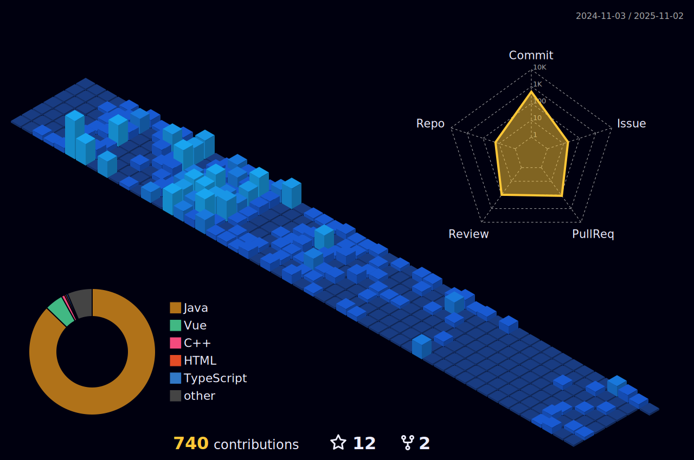

<H3> TechSkill </H3>

  
 
 
 
 
 
 
 
  

 

 
<H3>My project </H3>

rate limiter | 2025-01 | [rate-limiter](https://github.com/innercicle-be-rate-limiter/rate-limiter-spring-boot-starter)  
설문조사 서비스 | 2024-12 | [설문조사 서비스](https://github.com/cyeji/be-onboarding-project)

 
<H3> Github </H3>

<H3> BaekJoon </H3>

알고리즘 구현기술을 높히기 위해 꾸준히 알고리즘 문제를 풀어나가고 있습니다.  
현재는 **['알고리즘까지 브론즈가 될 순 없어'](https://github.com/algorithm-cote-study/baekjoon-algorithm)** 프로젝트를 만들어
함께 알고리즘 공부, 코드리뷰를 하고 있습니다.

<H3>Github</H3>

